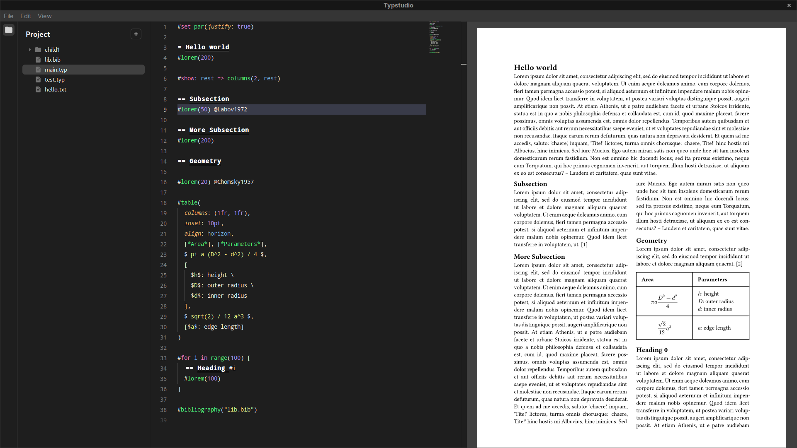

# [WIP] typstudio

A W.I.P desktop application for a new markup-based typesetting language, [typst](https://github.com/typst/typst).
Typstudio is built using [Tauri](https://tauri.app/).



## Features

- [x] Syntax highlighting
- [x] Real time preview
    - [ ] Navigate to source
- [x] Build/export
- [ ] Complete file explorer system
- [ ] Auto complete
- [ ] Linting and formatting
- [ ] Bibliography assistant
- [ ] Formatting assistant
- [ ] Project creation assistant / templates

...and more to come!

## Development

### Prerequisites

- [pnpm](https://pnpm.io/) and [Node.js](https://nodejs.org/en)
- [Rust toolchain](https://www.rust-lang.org/tools/install)
- [Tauri prerequisites](https://tauri.app/v1/guides/getting-started/prerequisites)

### Getting Started

```bash
pnpm install
pnpm tauri dev # or cargo-tauri dev
```

### Learn more
- [Tauri](https://tauri.app/v1/guides/)
- [Rust](https://doc.rust-lang.org/book/)
- [SvelteKit](https://kit.svelte.dev/docs/introduction) and [Svelte](https://svelte.dev/docs)
- [Tailwind CSS](https://tailwindcss.com/docs)
- [TypeScript](https://www.typescriptlang.org/docs/)

## License

Typstudio is licensed under [GPLv3](COPYING).
